# AI Agent System Architecture

> Status: Draft v1  
> Goal: Build a multi-agent software development system that can receive a specification and coordinate specialized agents from requirement analysis through implementation while maintaining human-confirmed project knowledge.

---

# 1. System Goals

The system receives a specification and coordinates specialized AI Agents such as:

- BA
- Designer
- Project Manager
- Tech Lead
- Backend
- Frontend
- QA
- Other future roles

The system must follow several fundamental rules:

1. Agents MUST NOT silently guess missing requirements.
2. Missing or ambiguous information MUST trigger clarification.
3. Important decisions MUST be confirmed by a human.
4. Confirmed decisions become project knowledge.
5. Confirmed decisions cannot be silently overwritten.
6. New requirements conflicting with confirmed decisions MUST stop for human confirmation.
7. Agents are loaded only when required.
8. Only relevant project context is loaded into an Agent.
9. Agent outputs are stored as traceable Artifacts.
10. Important executions must be auditable and reproducible.

---

# 2. Core Principles

## Rule 1 — UNKNOWN ≠ ASSUMPTION

Missing information must never automatically become an assumption.

```text
UNKNOWN
   │
   ▼
Generate Clarification Question
   │
   ▼
Human Answer
   │
   ▼
Validate
   │
   ▼
CONFIRMED
```

Wrong:

```text
Spec:
"Lock account after several failed logins."

Agent assumption:
"Several = 5"

❌ NOT ALLOWED
```

Correct:

```text
Spec:
"Lock account after several failed logins."

Agent:
"How many failed attempts should trigger the lock?"

Human:
"5 attempts."

Agent:
"Confirm: account will be locked after 5 failed attempts?"

Human:
"Confirm."

✅ CONFIRMED
```

---

## Rule 2 — CONFIRM BEFORE COMMIT

An Agent may:

- analyze
- reason
- detect problems
- ask questions
- suggest options

But it cannot convert its own suggestion into project truth.

```text
Agent Suggestion
      │
      ▼
Human Confirmation
      │
      ▼
Confirmed Decision
```

---

## Rule 3 — CONFIRMED DECISIONS ARE IMMUTABLE

A confirmed decision cannot be silently modified.

If a new requirement conflicts with an existing confirmed decision:

```text
STOP WORKFLOW
      │
      ▼
Show Existing Decision
      │
      ▼
Show New Requirement
      │
      ▼
Ask Human
```

Human must explicitly choose:

```text
KEEP EXISTING

or

REPLACE EXISTING
```

---

## Rule 4 — REPLACE MEANS VERSION, NOT DELETE

Old decisions must never disappear.

Example:

```text
DEC-001 v1

Login failed attempts: 5

Status:
SUPERSEDED
```

replaced by:

```text
DEC-001 v2

Login failed attempts: 3

Status:
CONFIRMED
```

This allows the system to understand project history.

---

## Rule 5 — AGENT ISOLATION

Agents are not globally loaded.

If the current workflow step requires Backend:

```text
Current Step
     │
     ▼
Backend Agent
```

Do NOT load:

```text
BA
Designer
PM
Tech Lead
Backend
Frontend
QA
```

into the same context.

---

## Rule 6 — RELEVANT CONTEXT ONLY

Agents should not receive the entire project history.

Example:

```text
Frontend Task:
Modify Login Screen

Context Builder
      │
      ├── Login requirements
      ├── Authentication decisions
      ├── Login UI design
      ├── Relevant API contract
      └── Relevant previous artifacts
```

Do NOT automatically include:

```text
Payment decisions
Reporting module
Notification history
Unrelated conversations
```

---

# 3. High-Level Architecture

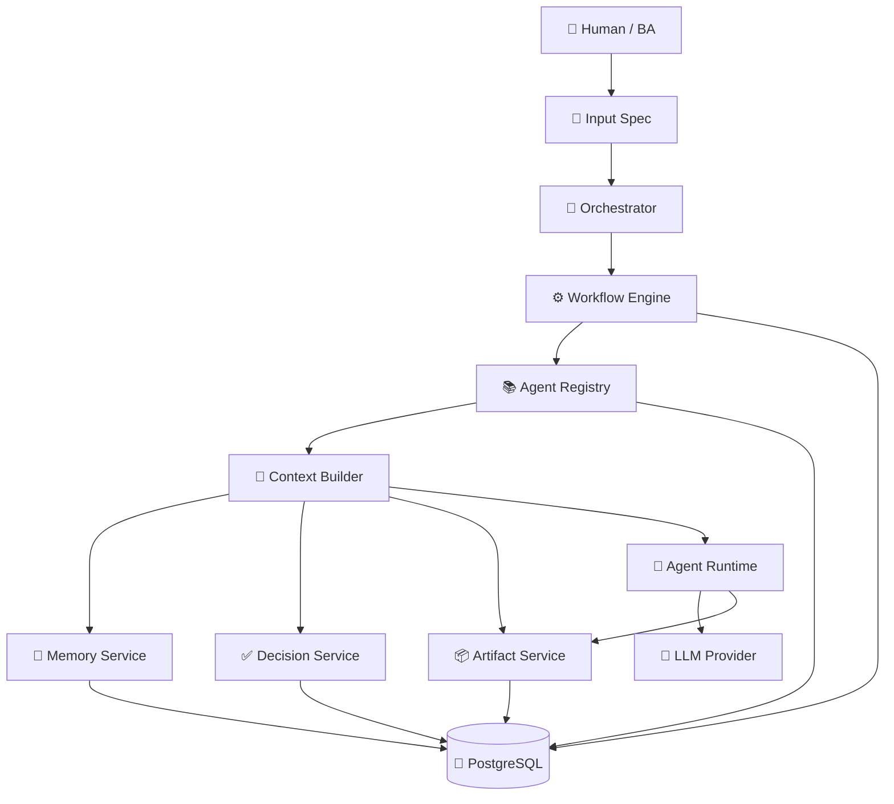

---

# 4. Main Processing Flow

Every task follows the same high-level lifecycle.

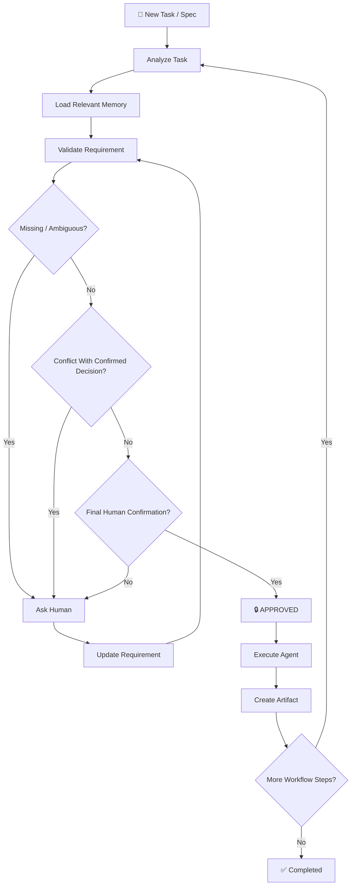

---

# 5. Clarification Loop

Requirement analysis is iterative.

The system continues asking questions until the requirement is sufficiently clear.

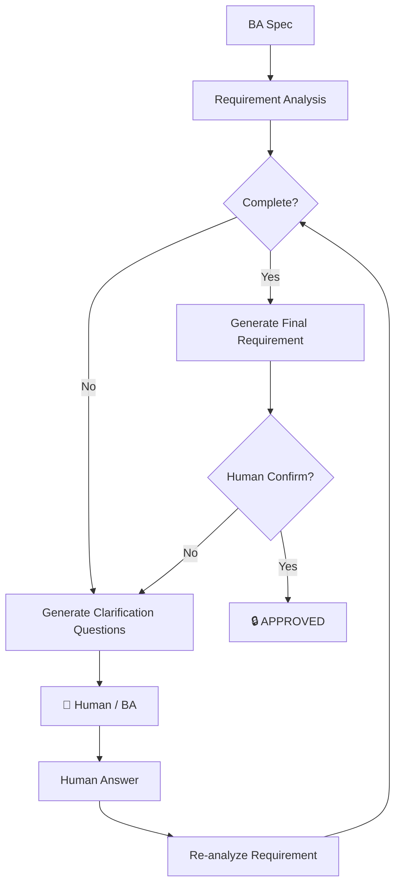

The loop may execute multiple times:

```text
Spec
 ↓
Question #1
 ↓
Answer
 ↓
Question #2
 ↓
Answer
 ↓
Question #3
 ↓
Answer
 ↓
Final Requirement
 ↓
Human Confirm
 ↓
APPROVED
```

There is no fixed maximum number of clarification rounds at the architecture level.

Correctness is more important than forcing the workflow forward with assumptions.

---

# 6. Requirement State Machine

Requirements should have explicit states.

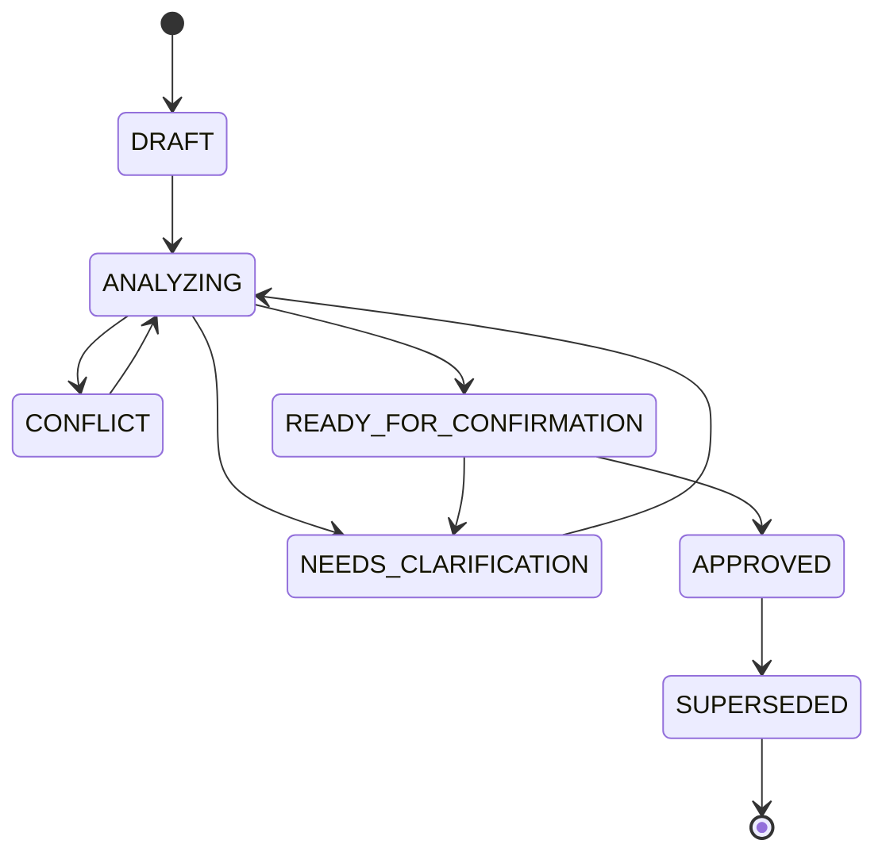

Suggested states:

```text
DRAFT

ANALYZING

NEEDS_CLARIFICATION

CONFLICT

READY_FOR_CONFIRMATION

APPROVED

SUPERSEDED
```

Only:

```text
APPROVED
```

may pass the Requirement Gate.

---

# 7. Requirement Gate

The Orchestrator must enforce requirement approval.

This rule must exist in application logic, not only inside an LLM prompt.

Conceptually:

```typescript
if (requirement.status !== "APPROVED") {
  throw new Error(
    "Workflow cannot continue because requirement is not approved."
  );
}
```

Therefore:

```text
LLM wants to continue
        │
        ▼
Requirement Gate
        │
   APPROVED?
    │       │
   NO      YES
    │       │
    ▼       ▼
   STOP   CONTINUE
```

The LLM cannot bypass this gate.

---

# 8. Confirmed Memory

Confirmed knowledge becomes reusable project context.

Example:

```text
Decision ID:
DEC-001

Domain:
Authentication

Topic:
Account Lock

Decision:
Lock account after 5 failed login attempts.

Lock Duration:
30 minutes

Confirmed By:
Human / BA

Status:
CONFIRMED
```

Later tasks related to Authentication can retrieve this decision.

---

# 9. Memory Types

Not every memory has the same authority.

```text
SHARED MEMORY
│
├── CONFIRMED_DECISION
│
├── PROJECT_KNOWLEDGE
│
├── PREFERENCE
│
└── OBSERVATION
```

Recommended authority:

```text
HIGH AUTHORITY
      │
      ▼
Confirmed Decision
      │
      ▼
Project Configuration
      │
      ▼
Approved Artifact
      │
      ▼
Project Knowledge
      │
      ▼
Preference
      │
      ▼
Observation
      │
      ▼
Agent Inference
      │
      ▼
LOW AUTHORITY
```

Agent inference must never automatically become a Confirmed Decision.

---

# 10. Memory Retrieval

Agents should retrieve memory based on the current task.

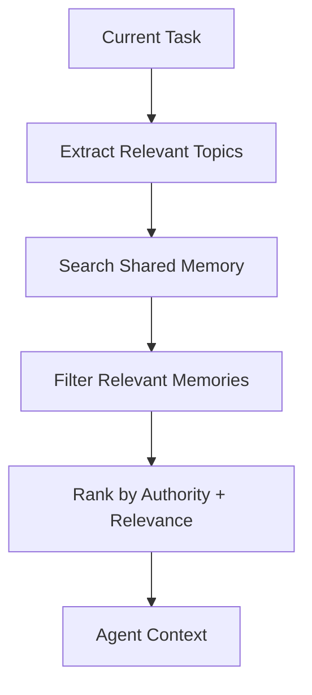

Example:

```text
Task:
Modify login behavior

Topics:
authentication
login
account-lock

Retrieved:

DEC-001
Account lock after 5 failures

DEC-004
Login success resets failure counter

DEC-008
JWT expiration = 30 minutes
```

Unrelated decisions should not be loaded.

---

# 11. Conflict Detection

Before accepting a new requirement, compare it against confirmed project knowledge.

Example:

Existing:

```text
DEC-001

Login failure threshold:
5 attempts
```

New Spec:

```text
Lock account after 3 failed attempts.
```

Result:

```text
CONFLICT
```

---

# 12. Conflict Resolution Flow

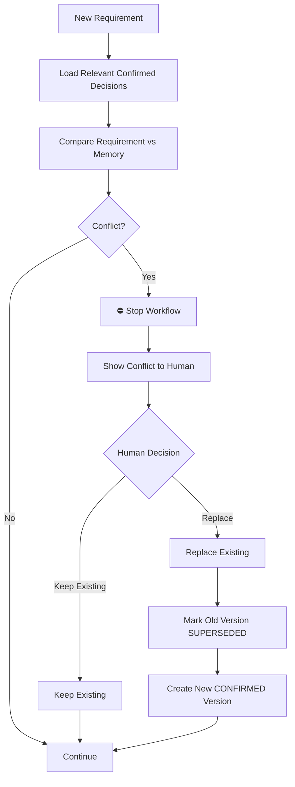

---

# 13. Decision Versioning

Never overwrite confirmed decisions.

Example history:

```text
DEC-001
│
├── v1
│   ├── value: 5 attempts
│   ├── status: SUPERSEDED
│   └── confirmed_at: ...
│
└── v2
    ├── value: 3 attempts
    ├── status: CONFIRMED
    └── confirmed_at: ...
```

This allows historical Agent Runs to remain reproducible.

Example:

```text
Backend Run #100
used
DEC-001 v1

Backend Run #205
used
DEC-001 v2
```

---

# 14. Agent Registry

Agent definitions live in PostgreSQL.

They should not be hard-coded into application source code.

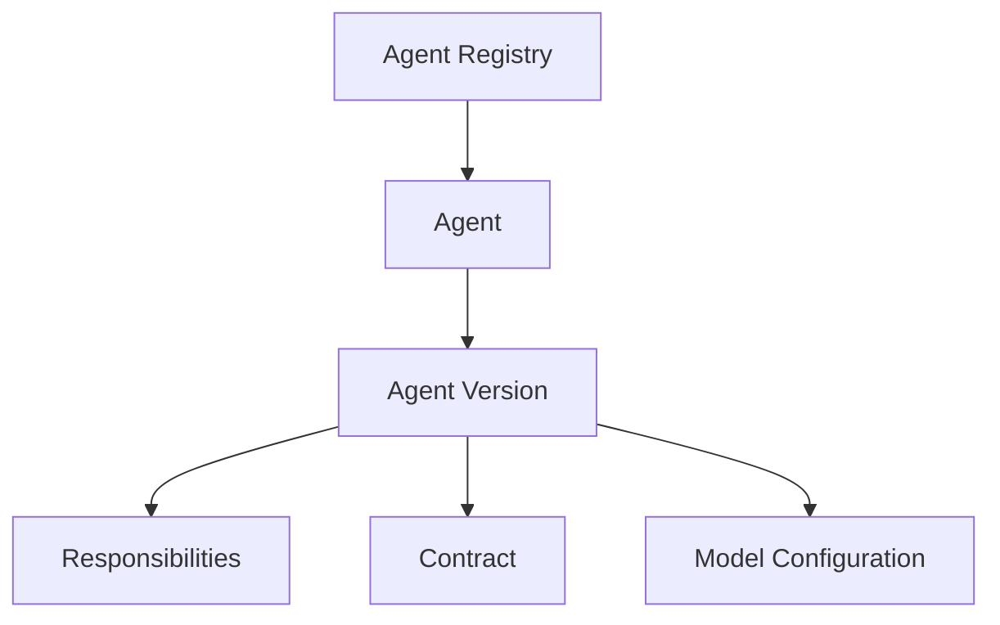

---

# 15. Agent Definition

Conceptually:

```text
Agent
│
├── Identity
│   ├── id
│   ├── code
│   ├── name
│   └── enabled
│
├── Version
│   ├── version
│   └── system_instruction
│
├── Responsibilities
│   ├── MUST_DO
│   ├── CAN_DO
│   └── MUST_NOT_DO
│
├── Contract
│   ├── input_contract
│   ├── output_contract
│   └── validation_rules
│
└── Model Configuration
    ├── provider
    ├── model
    ├── temperature
    └── token_limit
```

Example Agent codes:

```text
BA

DESIGNER

PM

TECH_LEAD

BACKEND

FRONTEND

QA
```

---

# 16. Agent Versioning

Agents themselves must be versioned.

Example:

```text
BA Agent
│
├── v1
│
├── v2
│
└── v3
```

Agent Runs reference the exact version used.

```text
Agent Run #100

Agent:
BA

Version:
v2
```

Therefore changing the BA prompt tomorrow does not destroy historical traceability.

---

# 17. Agent Loading Strategy

Suppose the current workflow step requires Backend.

```text
Workflow Step
      │
      ▼
BACKEND
      │
      ▼
Agent Registry
      │
      ├── Backend Identity
      ├── Backend Version
      ├── Backend Responsibilities
      ├── Backend Contract
      └── Backend Model Config
              │
              ▼
        Context Builder
```

Only Backend is loaded.

Not:

```text
BA
Designer
PM
Tech Lead
Backend
Frontend
QA
```

at the same time.

---

# 18. Runtime Agent Context

Context is assembled dynamically for every Agent Run.

```text
Agent Context
│
├── Global System Rules
│
├── Agent Definition
│   ├── Role
│   ├── Responsibilities
│   ├── Constraints
│   └── Output Contract
│
├── Current Task
│
├── Project Context
│
├── Relevant Confirmed Decisions
│
├── Relevant Shared Memory
│
├── Required Previous Artifacts
│
└── Execution Metadata
```

The context should contain the minimum information required for the task.

---

# 19. Artifact Architecture

Agent output should not exist only as chat messages.

Important outputs become Artifacts.

Examples:

```text
Requirement Analysis

Approved Requirement

UI Specification

Technical Design

API Contract

Database Design

Implementation Plan

Source Code

Test Plan

Test Result
```

Flow:

```text
Agent
  │
  ▼
Structured Output
  │
  ▼
Validation
  │
  ▼
Artifact
  │
  ▼
Next Agent
```

---

# 20. Artifact Traceability

Example:

```text
Original Spec
     │
     ▼
BA Run #12
     │
     ▼
Requirement Artifact v1
     │
     ▼
Tech Lead Run #15
     │
     ▼
Technical Design v1
     │
     ├──────────────┐
     ▼              ▼
Backend Run #18   Frontend Run #19
     │              │
     ▼              ▼
Backend Code      Frontend Code
```

This makes it possible to answer:

```text
Why does this code exist?

Which requirement created it?

Which decisions affected it?

Which Agent version generated it?

Which artifact was used as input?
```

---

# 21. Workflow Architecture

Workflow decides:

```text
WHO runs next
```

Agent decides:

```text
HOW to perform its assigned task
```

These concepts must remain separate.

Example:

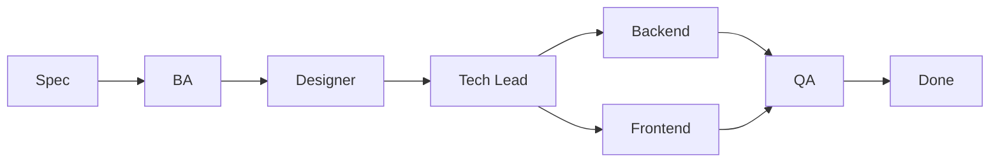

This is only an example workflow.

Future projects may use different workflows.

---

# 22. Workflow Runtime

```text
Workflow
│
├── Step 1
│   └── BA
│
├── Step 2
│   └── Designer
│
├── Step 3
│   └── Tech Lead
│
├── Step 4
│   ├── Backend
│   └── Frontend
│
└── Step 5
    └── QA
```

Each execution creates:

```text
Workflow Run
      │
      ├── Agent Run
      ├── Agent Run
      ├── Agent Run
      └── ...
```

---

# 23. Human-in-the-Loop Architecture

Human confirmation is a first-class part of the system.

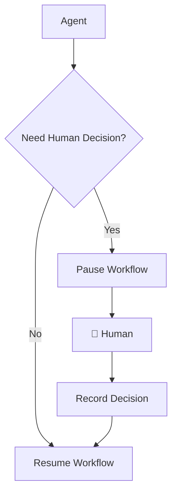

Situations requiring Human involvement include:

```text
Missing Requirement

Ambiguous Requirement

Conflicting Requirement

Breaking Existing Decision

Security-sensitive Decision

Architecture Decision

Explicit Final Approval
```

The exact list can evolve over time.

---

# 24. Complete Agent Execution Lifecycle

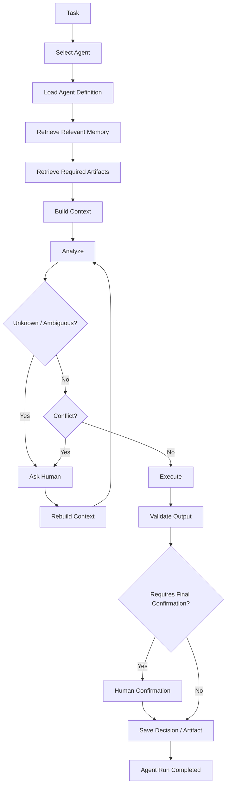

---

# 25. Database Concept

Initial conceptual model:

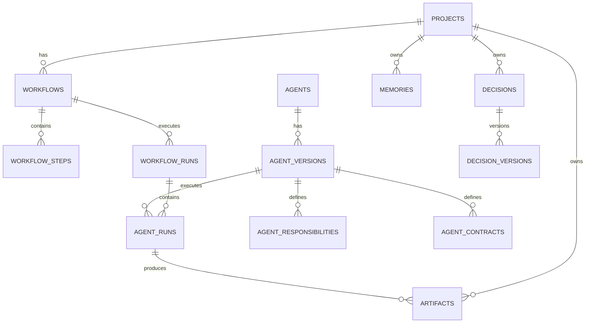

Initial conceptual tables:

```text
projects

agents
agent_versions
agent_responsibilities
agent_contracts

workflows
workflow_steps
workflow_runs

agent_runs

memories

decisions
decision_versions

artifacts
```

This schema is conceptual and may evolve during implementation.

---

# 26. Backend Architecture

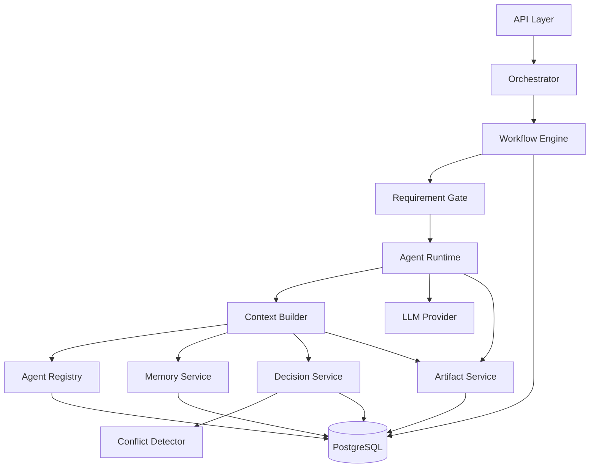

---

# 27. Suggested Backend Structure

```text
src/
│
├── config/
│   ├── database.ts
│   └── env.ts
│
├── agents/
│   ├── agent.types.ts
│   ├── agent.repository.ts
│   ├── agent.service.ts
│   └── agent-runtime.service.ts
│
├── orchestrator/
│   └── orchestrator.service.ts
│
├── workflows/
│   ├── workflow.types.ts
│   ├── workflow.repository.ts
│   └── workflow.service.ts
│
├── requirements/
│   ├── requirement.types.ts
│   ├── requirement.service.ts
│   ├── clarification.service.ts
│   └── requirement-gate.service.ts
│
├── memory/
│   ├── memory.types.ts
│   ├── memory.repository.ts
│   ├── memory.service.ts
│   └── memory-retrieval.service.ts
│
├── decisions/
│   ├── decision.types.ts
│   ├── decision.repository.ts
│   ├── decision.service.ts
│   └── conflict-detector.service.ts
│
├── artifacts/
│   ├── artifact.types.ts
│   ├── artifact.repository.ts
│   └── artifact.service.ts
│
├── llm/
│   ├── llm.types.ts
│   └── llm.service.ts
│
└── index.ts
```

Database migrations:

```text
database/
└── migrations/
```

Documentation:

```text
docs/
├── architecture.md
├── database.md
└── workflows.md
```

---

# 28. Example — Login Requirement

Initial Spec:

```text
If the user enters the wrong password several times,
lock the account.
```

BA Agent detects:

```text
UNKNOWN:

- How many failed attempts?
- Failed within what time window?
- How long is the account locked?
- Can Admin unlock it?
- Does successful login reset the counter?
- Should the user receive a notification?
```

Agent asks Human.

Human answers:

```text
Failed attempts:
5

Window:
15 minutes

Lock duration:
30 minutes

Admin unlock:
Yes

Successful login resets counter:
Yes

Notification:
No
```

Agent generates final requirement:

```text
Authentication / Account Lock

If a user fails authentication 5 times
within a 15-minute period,
the account is locked for 30 minutes.

An administrator may manually unlock the account.

Successful authentication resets the failed-attempt counter.

No lock notification is required.
```

Agent asks:

```text
Confirm this requirement?
```

Human:

```text
CONFIRM
```

System:

```text
Requirement:
APPROVED

Decision:
CONFIRMED

Artifact:
CREATED
```

---

# 29. Example — Future Conflict

Several weeks later:

```text
New Task:

Change login so the account is locked
after 3 failed attempts.
```

Memory retrieval finds:

```text
DEC-001

5 failed attempts

CONFIRMED
```

Conflict Detector returns:

```text
NEW:
3 attempts

EXISTING:
5 attempts

STATUS:
CONFLICT
```

The system pauses.

Human sees:

```text
Existing confirmed decision:

Lock after 5 failed attempts.

New requirement:

Lock after 3 failed attempts.

Choose:

KEEP EXISTING

or

REPLACE EXISTING
```

If:

```text
KEEP EXISTING
```

the existing decision remains authoritative.

If:

```text
REPLACE EXISTING
```

the system creates:

```text
DEC-001 v1
5 attempts
SUPERSEDED

DEC-001 v2
3 attempts
CONFIRMED
```

Workflow then continues using v2.

---

# 30. Traceability

Every important output should eventually be traceable.

Example:

```text
Project
  │
  ▼
Original Spec
  │
  ▼
Requirement Run
  │
  ├── Questions
  ├── Human Answers
  └── Confirmation
  │
  ▼
Approved Requirement
  │
  ▼
Confirmed Decisions
  │
  ▼
Technical Design
  │
  ▼
Backend / Frontend Implementation
  │
  ▼
QA
  │
  ▼
Completed Feature
```

The system should eventually be able to answer:

```text
Why was this implemented?

Which requirement requested it?

Who confirmed the requirement?

Which decisions were active?

Which Agent executed it?

Which Agent version?

Which model?

Which artifacts were used?

Which artifacts were produced?
```

---

# 31. Separation of Responsibilities

## Orchestrator

Responsible for:

```text
What happens next?
```

It does NOT perform BA/FE/BE work itself.

---

## Workflow Engine

Responsible for:

```text
Which workflow step is active?

Which step can run next?

Is the workflow paused?

Is human input required?
```

---

## Agent Registry

Responsible for:

```text
What Agents exist?

Which version is active?

What are their responsibilities?

What are their contracts?
```

---

## Context Builder

Responsible for:

```text
What information does this Agent actually need?
```

---

## Memory Service

Responsible for:

```text
What relevant project knowledge exists?
```

---

## Decision Service

Responsible for:

```text
What has already been explicitly confirmed?
```

---

## Conflict Detector

Responsible for:

```text
Does this new information contradict
an existing confirmed decision?
```

---

## Requirement Gate

Responsible for:

```text
Is this requirement allowed to proceed?
```

---

## Agent Runtime

Responsible for:

```text
Execute one Agent using one controlled context.
```

---

## Artifact Service

Responsible for:

```text
Store and retrieve meaningful outputs
between Agents.
```

---

# 32. Important Boundary

The LLM is NOT the system.

The LLM is one component inside the system.

```text
              OUR APPLICATION
┌─────────────────────────────────────┐
│                                     │
│ Orchestrator                        │
│ Workflow Engine                     │
│ Requirement Gate                    │
│ Agent Registry                      │
│ Context Builder                     │
│ Memory                              │
│ Decisions                           │
│ Conflict Detection                  │
│ Artifact Management                 │
│                                     │
│               │                     │
│               ▼                     │
│             LLM                     │
│                                     │
└─────────────────────────────────────┘
```

Important business rules should therefore be enforced by application code whenever possible.

Do NOT rely solely on prompts such as:

```text
"Please remember not to make assumptions."
```

Instead enforce behavior structurally:

```text
Requirement not APPROVED
        ↓
Workflow cannot continue
```

and:

```text
Confirmed Decision Conflict
        ↓
Workflow pauses
        ↓
Human decision required
```

---

# 33. MVP Implementation Strategy

Do NOT build the entire architecture immediately.

Build vertically.

## Phase 1

```text
Spec
 ↓
Requirement Analysis
 ↓
Clarification
 ↓
Human Confirmation
 ↓
Confirmed Decision
 ↓
PostgreSQL
```

Goal:

Validate the most important system rule:

> AI cannot silently convert uncertainty into project truth.

---

## Phase 2

Add:

```text
Agent Registry

Agent Versions

Responsibilities

Contracts
```

---

## Phase 3

Add:

```text
Shared Memory Retrieval

Decision Retrieval

Conflict Detection

Decision Versioning
```

---

## Phase 4

Add:

```text
Workflow Engine

Orchestrator

Multiple Agents
```

---

## Phase 5

Add:

```text
Artifacts

Traceability

Agent Run History
```

---

## Phase 6

Add specialized Agents:

```text
BA
Designer
Tech Lead
Backend
Frontend
QA
```

---

# 34. Final Architecture Principle

The system should behave according to:

```text
DO NOT KNOW
      ↓
ASK

KNOW BUT NOT CONFIRMED
      ↓
CONFIRM

CONFIRMED
      ↓
REMEMBER

NEW INFORMATION
      ↓
COMPARE WITH MEMORY

NO CONFLICT
      ↓
CONTINUE

CONFLICT
      ↓
STOP

HUMAN DECIDES
   │          │
   ▼          ▼
 KEEP       REPLACE
              │
              ▼
         CREATE VERSION
              │
              ▼
           CONTINUE
```

The system must never silently transform:

```text
AI GUESS
```

into:

```text
PROJECT FACT
```

Human-confirmed knowledge is the source of truth.